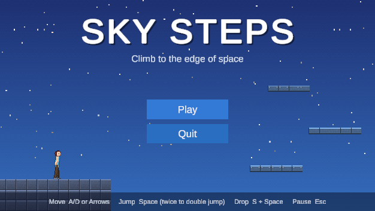
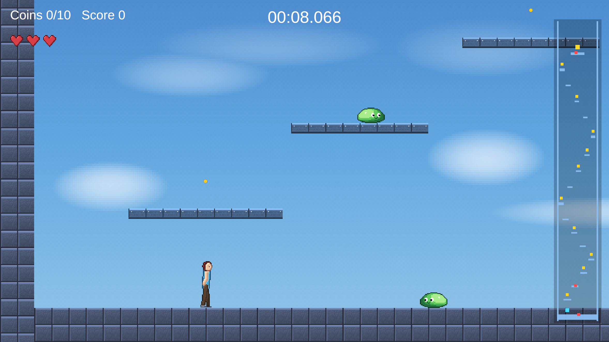

# Sky Steps

A 2D vertical-climbing platformer made in Unity 6 — **built entirely through AI.**
Every script, GameObject, component, Inspector value and asset in this project was created by
Claude Code working through an MCP bridge to the Unity Editor. No C# was written by hand, and
nothing was created or edited manually in the Editor.

## How to play

Climb from the ground to the gold goal at the top of the sky. The game opens on a title screen;
press **Play** to start.

| Action | Keyboard | Gamepad |
|---|---|---|
| Move | A / D or ← / → | Left stick or D-pad |
| Jump | Space | South button (A) |
| Double jump | Jump again in mid-air | Jump again in mid-air |
| Drop through a platform | Hold S or ↓, then Jump | Hold down, then Jump |
| Pause | Esc | Start |
| Menu buttons | Mouse, or ↑ / ↓ and Enter | D-pad and South button (A) |

- **Coins:** 10 in the level, 10 points each. They show as yellow dots on the minimap.
- **Slimes** patrol the ground floor, a low platform and the summit. Land on one to squash it for
  **20 points** and a bounce that gives your double jump back; touch one from the side and you lose
  a life. They show as red dots on the minimap.
- **Spikes** cost a life. You respawn on the last platform you stood on, briefly invulnerable.
- **Lives:** 3. Lose them all and it's **Game Over**.
- **Timer:** runs until you reach the goal. The result screen shows coins, score and time, with a
  **Restart** button.
- **Pause** at any time for Resume, Restart or Quit to Title. The timer stops while paused.
- The pale **plank** platforms can be jumped up through and dropped down through; **stone** ones
  are solid.

## Assignment checklist

| Requirement | Where it is |
|---|---|
| Controllable player | Run, jump, double jump, drop through platforms — `Assets/Scripts/Player` |
| Clear goal | Reach the gold goal at the top of the level |
| Win condition | Goal trigger shows **"You Win!"** — `LevelGoal`, `ResultScreen` |
| Challenge / lose condition | Spikes, patrolling slimes, 3 lives, **"Game Over"** — `Hazard`, `StompableEnemy`, `PlayerHealth` |
| At least 3 interactive objects | Coins, spikes, slimes, one-way platforms, the goal |
| At least 3 AI-generated assets | Over 30 — see below |
| Basic UI | Title screen; pause menu; lives, coins, score and timer HUD; minimap; result popup |
| Score, lives, time or other metric | All three: score, lives and a run timer |
| Restart | Restart on the result popup or the pause menu reloads the level |
| Short video | Submitted separately |

## Built entirely by AI

- **Tools:** Claude Code (Anthropic), connected to the Unity Editor through
  [MCP for Unity](https://github.com/CoplayDev/unity-mcp), an open-source Model Context Protocol
  bridge.
- **Every change went through MCP tool calls:** scripts were created and edited
  (`create_script`, `script_apply_edits`); GameObjects and components were created and configured
  (`manage_gameobject`, `manage_components`); scenes, prefabs and assets were managed
  (`manage_scene`, `manage_prefabs`, `manage_asset`); and editor automation ran as C# executed
  inside the Editor (`execute_code`).
- **Verification:** the Unity console was read after every change, and each feature was tested in
  play mode with scripted checks — for example, jump height, one-way platform behaviour, and that
  swapping in tiled platforms left every collider exactly where it was.
- **Evidence:** the commit history records the build step by step. Commits made from Claude Code
  are marked `Co-Authored-By: Claude`; the first player-controller commit was built the same way
  but committed by hand.

## AI-generated assets

Every asset was generated by code that Claude wrote and ran inside the Editor. No image or audio
model was used, and nothing was drawn or recorded by hand.

| Asset | How it was made |
|---|---|
| **Player animation** — 17 frames: idle ×4, run ×8, jump ×2, land ×3 | A posable skeleton (head, torso, arms with elbows, legs with knees) rendered to 40×64 pixel art. Each frame is the same body in a different pose, so all frames stay consistent. |
| **Sky backdrop** | Procedural gradient from hazy horizon to deep space, with clouds, a star field that thickens with height, and ordered dithering |
| **Platform tiles** — stone and plank | Procedural tiles with lit edges, joints and speckle, repeated across each platform |
| **Slime enemy** — 5 frames: hop ×4, squashed ×1 | A shaded, outlined dome whose proportions change per frame (settle, squash, stretch in the air, land), with a face drawn on top |
| **HUD pixel font** — digits, A–Z and punctuation | A 5×7 pixel alphabet drawn as data, with a dark outline and drop shadow baked in, packed into a TextMeshPro font asset. Digits share one width so the running timer never shifts |
| **Spikes** and **heart icon** | Code-drawn pixel art |
| **Dust and sparkle particles** | Code-drawn sprites for the jump and landing dust, the coin-pickup burst and the stomp splat |
| **8 sound effects** | Synthesised chiptune: jump, air jump, land, coin, stomp, hurt, win, game over |
| **Background music** — 2 layers | A 16-bar loop in F major composed as data and synthesised. The second layer fades in as you climb, so the music moves from sky to space with the visuals. |

## How it works

Scripts are grouped by responsibility under `Assets/Scripts`:

| Folder | Scripts |
|---|---|
| `Player/` | `PlayerController` (coordinates the systems), `PlayerInputReader` (Input System), `PlayerMotor` (acceleration, friction, jumps), `PlayerContactProbe` (swept-AABB ground, wall and ceiling detection), `JumpRules` (coyote time, jump buffer, double jump), `OneWayPlatformDropper`, `PlayerHealth`, `PlayerAnimator`, `PlayerMovementSettings` (tuning asset) |
| `Enemies/` | `PatrolMover` (walks between two points), `StompableEnemy` (stomp or hurt, decided by how the player touches it) |
| `Level/` | `Coin`, `Hazard`, `LevelGoal`, `ScoreSystem`, `LevelTimer` |
| `Camera/` | `CameraFollow2D`, `CameraBounds`, `ParallaxLayer`, `DamageCameraShake` |
| `Effects/` | `FootDustEmitter` (dust on takeoff and landing), `CoinSparkleEmitter`, `StompPuffEmitter`, `PlayerDamageFlash` |
| `UI/` | `TitleScreenMenu`, `PauseMenu` (freezes time, mutes audio, halts player input), `SceneLoader` (every scene change, resetting pause state), `ResultScreen`, `ScoreHud`, `LivesHud`, `TimerHud`, `Minimap`, `MinimapMarker` |
| `Audio/` | `SoundEffectPlayer`, `AltitudeMusicMixer` (fades the space layer in with height) |

Design choices:

- **Events, not coupling.** Gameplay systems announce what happened (`Jumped`, `Landed`,
  `CoinCollected`, `Damaged`, `Shown`), and the UI, audio and visual effects listen. Gameplay code
  never touches any of them.
- **One job per class.** For example, movement is split into input, motor, contact detection and
  jump rules rather than one large player script.
- **No scene searches or per-frame waste.** References are wired in the Inspector (via MCP) rather
  than found at runtime; components are looked up once and cached, never repeatedly in per-frame
  code; there is no LINQ; and the on-screen timer redraws every frame without allocating memory.

## Opening the project

Unity **6000.3.9f1** with URP 2D. Open `Assets/Scenes/Title.unity` and press Play. The level itself
is `Assets/Scenes/Level01.unity`; both are in the build, title first.
